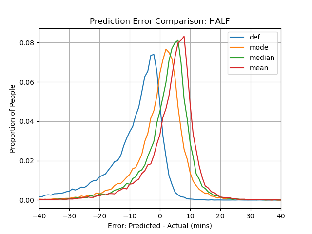

<!--
```{css, echo=FALSE}
div.title_container{
   background-color: #C8102E;
}

div.logo_left{
  background-color: #A4804A;
}
div.logo_right{
  background-color: #A4804A;
}
```
-->
```{r setup, include=FALSE}
knitr::opts_chunk$set(echo = FALSE)
```

# Introduction
In the middle of a marathon, expected finish times are typically estimated by naively extrapolating the average pace covered so far, assuming it will be held constant for the rest of the race. These predictions have two major issues:

1. The estimates only use one piece of data (the average pace so far) to predict the finish time
2. The prediction is a single point estimate with no information about uncertainty. 

An empirical Bayesian inference model addresses both concerns by using the runner's previous splits in the race to generate a probability distribution of possible finish times. The posterior finish distribution directly quantifies the uncertainty behind the estimate. 

# Data
We scraped Boston Marathon results from the Boston Athletic Association (BAA) website. Our dataset contains the name, age, gender, and splits (5K, 10K, 15K, 20K, HALF, 25K, 30K, 35K, 40K, and FINISH, all in seconds) for every finishing runner of the Boston Marathon from 2009-2023 (312,805 total). We partitioned this data into a training set (286,777 runners from 2009-2022) and a test set (26,028 runners from 2023).

# Model
The model utilizes Bayes theorem to iteratively update the posterior finish time distribution: Using a runner's splits so far (s_1, ..., s_t), the model predicts the finish split (s_f) according to the following equation: 

$$P(s_f | s_{1:t}) ∝ P(s_t | s_f, s_{1:t-1}) * P(s_f | s_{1:t-1})$$

In this equation, the posterior distribution is the normalized product of the likelihood distribution and the prior distribution. Likehihoods are estimated empirically.


# Results

We found that the model predictions have similar absolute errors (predicted time - actual time) to the default predictor earlier in the race (Fig. 1 left), and outperform the default predictor as more splits are used (Fig. 1 right). Visually, as time goes on, more people are concentrated around the 0, meaning there is very little error.

From these tables, we are able to plot the posterior distributions at each iteration on a single plot, an example of which is shown below.

<!-- -->

        
<figure>
<p align="center">

  
  
  <figcaption><em>Fig.1 - The errors of the posterior <span style="color:#ff7f0e">modes</span> of the model's predictions, compared to the errors of the naive <span style="color:#1f77b4">default</span> predictor. Posterior <span style="color:#2ca02c">medians</span> and <span style="color:#d62728">means</span> are also included. Errors are shown for after 10K (left) and after 30K (right). Distributions more centered around zero have smaller errors.</em></figcaption>
</p>
</figure>

<!--
<p align="center">
  
  <figcaption>Fig.1 - The posterior #ff7f0emodes of the model's predictions (yellow) have comparable errors to the <span style="color:#1f77b4">naive default predictor</span>. Posterior medians (green) and means (red) are also included.</figcaption>
</p>
-->


<p align="center">
  
  <figcaption><em>Fig.2 - Finish time estimate plot containing all splits for Vinny Castronuovo (fastest male Bostonain, former Northeastern Club Running President) The actual finish time is denoted with the vertical dotted black line.</em></figcaption>
</p>

# Conclusion

Scan the QR code to access the website for this project. It contains functionality to automatically generate a finish time distribution plot given your own splits, and also allows you to view the plots of select past runners (namely, Northeastern Club Running runners that ran in 2023). This app can be used to get a better sense of uncertainty than the traditional estimates given by the BAA during the marathon.

<p align="center">
  
</p>

```{r, include=FALSE}
knitr::write_bib(c('knitr','rmarkdown','posterdown','pagedown'), 'packages.bib')
```

# References
