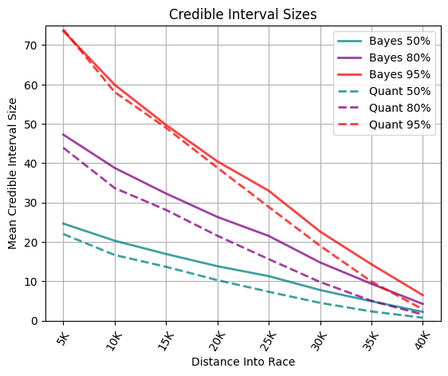
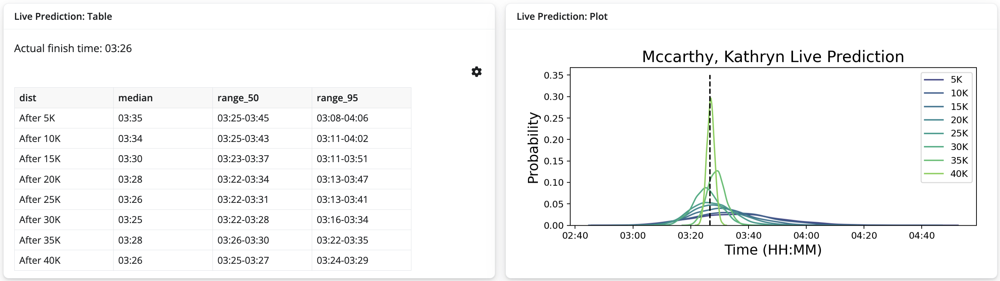

# Introduction

In the middle of a marathon, a runner’s expected finish time is commonly estimated by extrapolating the average pace covered so far, assuming it to be constant for the rest of the race. These predictions have two key issues:

1. the estimates do not consider the in-race context that can determine if a runner is likely to finish faster or slower than expected
2. the prediction is a single point estimate with no information about uncertainty. 

We implement two approaches to address these issues: Bayesian linear regression and quantile regression. Both methods incorporate multiple pieces of information from the race and allow us to quantify uncertainty around the predicted finish times. 

# Data

We scraped Boston Marathon finisher results from the Boston Athletic Association (BAA) website. Our dataset contains the name, age, gender, and splits (5K, 10K, 15K, 20K, HALF, 25K, 30K, 35K, 40K, and FINISH, all in seconds) for every finishing runner of the Boston Marathon from 2009-2023 (312,805 total). We partitioned this data into a training set (286,777 runners from 2009-2022) and a test set (26,028 runners from 2023).

# Method

The traditional method of extrapolating the current pace (**Method A**) is used as a baseline. We examine three additional possible linear relationships between a runner's splits and their finish time:

- **Method B**: the overall pace so far is a single predictor
- **Method C**: the overall pace so far and the "current pace" (the pace of the most recent 5K) are the predictors
- **Method D**: all previous splits are used as predictors

# Results
Method C outperforms Methods A and B when comparing prediction root mean squared error (RMSE). Method D has very similar performance to Method C, but has problems with collinearity, as a runner's previous splits are strongly correlated with each other. Thus, we decide to use the **Method C** relationship to implement both Bayesian and quantile regression.

As shown in Figure 1, the two models have very similar test RMSE at all levels of the race. Both improve upon the traditional method at all levels, and significantly outperform it in the middle stages of the race. It is important to have better finish estimates here, as there is the greatest amount of uncertainty in the middle of the race.

{width="520"}

Additionally, we perform checks on the models to confirm they fit our assumptions. In Figure 2, we show that the credible interval sizes, on average, decrease as one gets further into the race, fitting with the intuition that one should be more certain of the estimate as they get closer to finishing. We also verify that, for a given X% interval, approximately X% of runners actually finish within that interval, which gives validity to our interpretation of the credible intervals.

We can plot the posterior distributions at each iteration on a single plot; an example of which is shown in Figure 3.

{width="440"}

{width="1120"}

# Conclusion

The QR code above links to our app, containing functionality to automatically generate a finish time distribution plot given your own splits. This app can be used to get a better sense of uncertainty than the traditional estimates given by the BAA during the marathon.

# References
